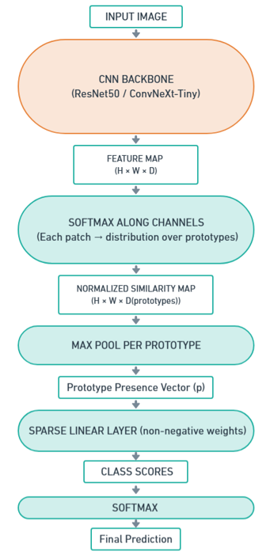
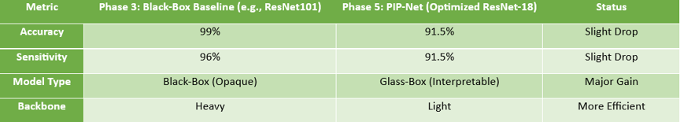
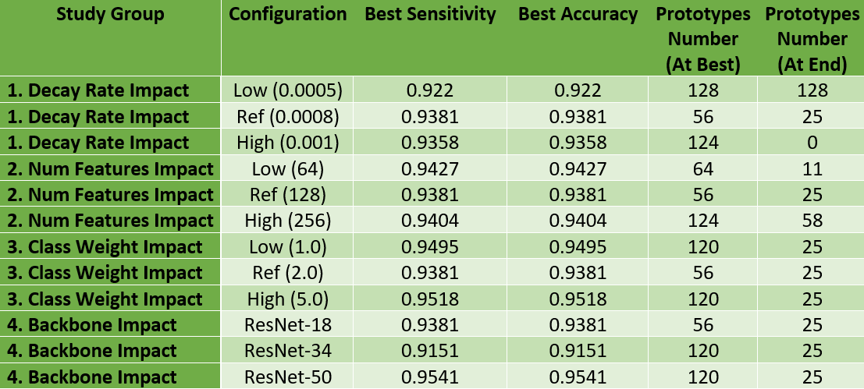
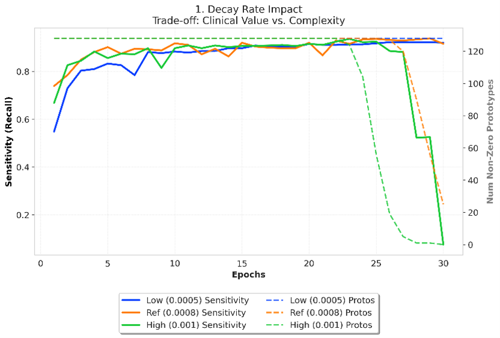
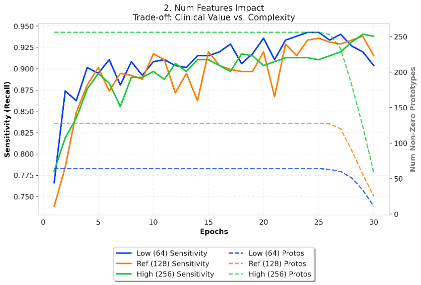
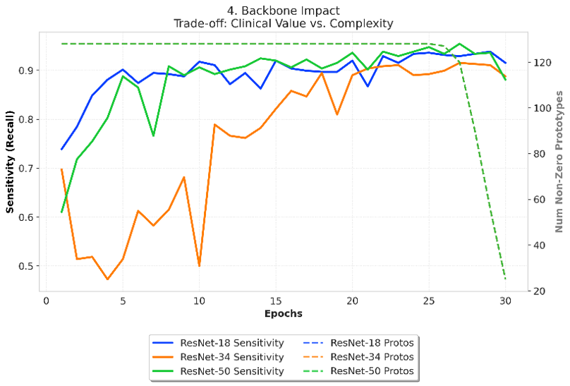
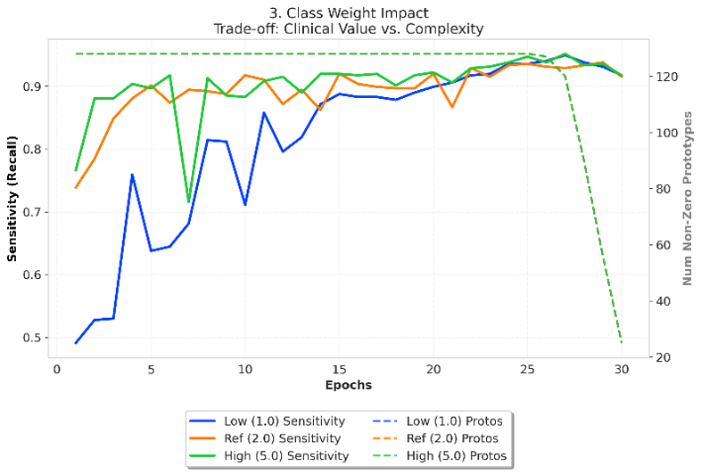
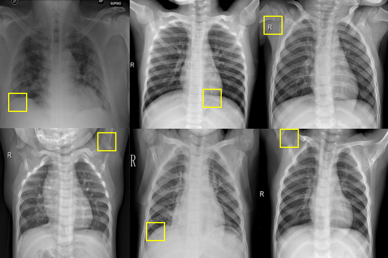

# Interpretable Medical Image Classification using Prototype-based Deep Learning

Implementation and analysis of an interpretable deep learning framework for **COVID-19 chest X-ray classification** based on **PIP-Net (Patch-based Intuitive Prototypes Network)**.

This project was completed as part of the **Computer Vision** course during my **M.Sc. studies in Data Science at the University of Tehran**. Beyond reproducing the original method, the project focuses on adapting PIP-Net to a real-world medical imaging task through architectural modifications, systematic experimentation, and explainability analysis.

---

## Project Overview

Deep neural networks have achieved remarkable performance in medical image classification; however, their lack of transparency remains a major barrier to clinical adoption. This project investigates how **prototype-based explainable AI (XAI)** can improve the interpretability of deep learning models while maintaining competitive diagnostic performance.

The original PIP-Net framework was customized and extended to classify **COVID-19 chest X-ray images** under practical computational constraints. Multiple components of the official implementation were redesigned, including the data pipeline, pruning strategy, evaluation metrics, and visualization modules, followed by an extensive hyperparameter study.

The project further analyzes the trade-off between **classification performance**, **computational efficiency**, and **clinical interpretability**, demonstrating both the strengths and limitations of prototype-based reasoning in medical AI.

---

## Key Features

* Implementation of the PIP-Net architecture for interpretable medical image classification.
* Adaptation of the official implementation to COVID-19 chest X-ray datasets.
* Customized preprocessing and dataset handling pipeline.
* Redesigned prototype pruning mechanism for improved training stability.
* Evaluation using clinically relevant metrics including Accuracy, Sensitivity, F1-score, and AUC.
* Systematic hyperparameter optimization across multiple model configurations.
* Visual explanation through learned prototypes and prototype-based predictions.
* Investigation of Shortcut Learning and dataset bias using explainable AI techniques.

---

## Project Highlights

* Customized the original PIP-Net implementation for a new medical imaging task.

* Performed systematic experiments on multiple critical hyperparameters.

* Reduced computational cost while maintaining strong diagnostic performance.

* Achieved an optimized interpretable baseline with approximately **91–92% classification accuracy** and **93–94% peak sensitivity**.

* Demonstrated how explainability can reveal dataset bias and Shortcut Learning that remain hidden in conventional black-box models.

---

## Resources

**Project Report**

The complete technical report describing the implementation, experiments, and analysis is available in the `reports/` directory.

**Kaggle Resources**

The complete implementation, datasets, execution history, trained models, and experimental outputs are publicly available on Kaggle.

---

## Methodology

The project follows a complete research-oriented workflow for developing and evaluating an interpretable deep learning model for medical image classification.

The overall pipeline consists of the following stages:

1. **Problem Selection**

   * Selection of a recent medical image classification problem based on COVID-19 chest X-ray diagnosis.
   * Analysis of dataset characteristics, preprocessing strategies, and experimental protocols.

2. **Interpretable Model Selection**

   * Comparative analysis of multiple prototype-based explainable AI methods.
   * Selection of **PIP-Net** due to its intuitive prototype learning mechanism and computational efficiency.

3. **Model Adaptation**

   * Custom modification of the original PIP-Net implementation.
   * Development of a dedicated data loading pipeline for COVID-19 chest X-ray images.
   * Implementation of customized prototype pruning and training strategies.
   * Adaptation of evaluation metrics for medical image analysis.

4. **Experimental Evaluation**

   * Construction of a stable computational baseline.
   * Systematic hyperparameter optimization.
   * Performance evaluation under multiple experimental settings.
   * Prototype visualization and explainability analysis.

5. **Clinical Interpretation**

   * Investigation of whether learned prototypes correspond to clinically meaningful regions.
   * Analysis of dataset bias and Shortcut Learning through prototype visualization.

---

## Dataset

The experiments were conducted on a publicly available COVID-19 chest X-ray dataset derived from the dataset used in the reference medical image classification study.

The preprocessing pipeline includes:

* Image resizing
* Intensity normalization
* Conversion of single-channel X-ray images into three-channel inputs for compatibility with ImageNet-pretrained backbones
* Stratified Train / Validation / Test split
* Class imbalance handling using weighted sampling

---

## Model Customization

Rather than directly using the official implementation, several components of the original PIP-Net framework were redesigned and adapted for this project.

Major modifications include:

* Customized COVID-19 dataset interface.
* Redesigned preprocessing pipeline.
* Stable prototype pruning strategy.
* Improved training schedule for lightweight hardware.
* Medical-oriented evaluation metrics.
* Optimized visualization modules.
* Hyperparameter optimization framework for systematic experimentation.

These modifications enabled stable training under limited computational resources while preserving the interpretability objectives of the original model.

---

## Project Resources

The complete project is distributed across several publicly available Kaggle resources.

### Datasets

* COVID-19 Chest X-ray dataset
* Customized PIP-Net repository
* Original PIP-Net source code

### Kaggle Notebooks

* Final implementation and code customization
* Optimization and hyperparameter analysis
* Visualization and experimental results

The direct links to all datasets and notebooks will be provided in the final section of this README.

---

## Computational Environment

The experiments were designed under practical computational constraints and optimized for execution on limited GPU resources.

Main implementation technologies include:

* Python
* PyTorch
* NumPy
* OpenCV
* scikit-learn
* Kaggle Notebooks
* NVIDIA Tesla P100 GPU (16 GB VRAM)

---

# Experimental Results

The customized PIP-Net implementation was evaluated through multiple controlled experiments focusing on predictive performance, computational efficiency, and interpretability.

The final optimized configuration successfully produced an interpretable model that remained computationally feasible while preserving strong diagnostic performance on COVID-19 chest X-ray classification.

---

## Model Architecture

The implementation is based on the original PIP-Net framework with several architectural modifications specifically designed for medical image analysis and limited GPU environments.

Major modifications include:

* Customized COVID-19 data pipeline
* Stable prototype pruning strategy
* Lightweight ResNet-18 backbone
* Medical-oriented evaluation metrics
* Improved visualization pipeline
* Hyperparameter optimization framework

---

## Performance Comparison

Compared with the high-performing black-box baseline models, the optimized PIP-Net model achieved competitive performance while providing transparent visual explanations for every prediction.

Although a moderate reduction in classification accuracy is observed, the resulting gain in interpretability makes the model considerably more suitable for safety-critical medical applications.

---

## Overall Performance

The optimized baseline demonstrates a balanced trade-off between predictive performance and interpretability.

Key observations include:

* Stable convergence
* High sensitivity for COVID-19 detection
* Successful prototype pruning without model collapse

---

# Hyperparameter Study

A systematic hyperparameter analysis was conducted to investigate the effect of different architectural and optimization choices.

---

### Decay Rate

The pruning decay rate proved to be the most influential parameter affecting prototype stability.

A conservative value preserved too many prototypes, while aggressive pruning resulted in Sparsity Collapse.

---

### Number of Features

Increasing feature capacity improved predictive performance but reduced model compactness by producing a larger number of prototypes.

---

### Backbone Architecture

Despite having fewer parameters, ResNet-18 provided the best balance between computational efficiency, convergence stability, and predictive performance for this dataset.

---

### Class Weight Stability

Changing the classification loss weight produced only minor variations in performance, indicating that the optimized architecture is relatively robust to moderate changes in this hyperparameter.

---

# Prototype Visualization

One of the primary advantages of prototype-based learning is the ability to directly inspect the visual evidence used by the model.

Interestingly, the learned prototypes reveal that the network frequently focuses on non-clinical image characteristics such as surrounding borders, bones, radiographic markers, and acquisition artifacts instead of pulmonary abnormalities.

This observation exposes a clear case of **Shortcut Learning**, demonstrating that high predictive accuracy alone is insufficient for assessing model reliability in medical imaging.

The explainability provided by PIP-Net therefore serves not only as an interpretation mechanism but also as a practical tool for identifying dataset bias and improving AI safety.

---

# Reproducibility

The complete implementation, execution history, trained models, and experimental outputs are publicly available through Kaggle.

## Kaggle Datasets

* **COVID-19 Chest X-ray Dataset**

  * https://www.kaggle.com/datasets/alishekaarchi/pipnet-project-data

* **Customized PIP-Net Repository**

  * https://www.kaggle.com/datasets/alishekaarchi/pipnet-phase5-stable

* **Original PIP-Net Source Code**

  * https://www.kaggle.com/datasets/alishekaarchi/pipnet-github-repository

---

## Kaggle Notebooks

### Final Code Customization

https://www.kaggle.com/code/alishekaarchi/cv-project-phase-5-final-version

Contains the complete customization of the original PIP-Net implementation.

---

### Optimization & Hyperparameter Analysis

https://www.kaggle.com/code/alishekaarchi/cv-project-phase-5-optimization-analysis

Contains all training experiments, checkpoints, optimization studies, and execution history.

---

### Visualization & Results

https://www.kaggle.com/code/alishekaarchi/cv-project-phase-5-visualization-results

Contains all visual analyses, prototype inspection, plots, and performance summaries.

---

# References

## Original PIP-Net Paper

Nauta, M., et al.

**PIP-Net: Patch-Based Intuitive Prototypes for Interpretable Image Classification.**

CVPR 2023.

---

## Reference Medical Classification Paper

An Analysis on Ensemble Learning Optimized Medical Image Classification with Deep Convolutional Neural Networks.

IEEE Access.

---

# Acknowledgments

This project was completed as part of the Computer Vision course during the M.Sc. program in Data Science at the University of Tehran under the supervision of Dr. Fatemeh Ziaeetabar.

The project builds upon the official implementation of PIP-Net and extends it through customized modifications for interpretable COVID-19 chest X-ray classification under practical computational constraints.

---

# License

This repository is intended for academic and research purposes.

Please cite the original PIP-Net paper if you use any part of the original implementation.

---

# Contact

**Ali Shekarchi**

GitHub:

https://github.com/AliShekaarchi

For questions, suggestions, or collaboration opportunities, feel free to open an Issue or contact me through GitHub.

Detailed links will be provided in the next section of this README.

